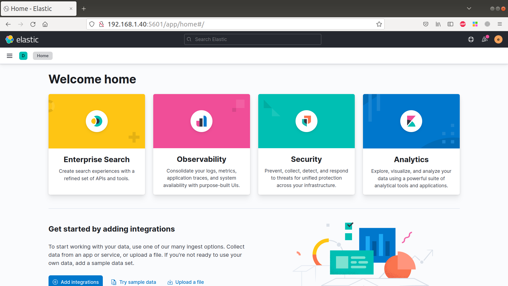

# Elasticsearch Kibana

- [Задание](#Задание)
- [Установка](#Установка)

## Задание
1. Установить Elasticsearch
2. Установить Kibana

## Установка
Downloading ElasticSearch and Kibana from Yandex mirror
```
wget https://mirror.yandex.ru/mirrors/elastic/8/pool/main/e/elasticsearch/elasticsearch-8.1.1-amd64.deb
wget https://mirror.yandex.ru/mirrors/elastic/8/pool/main/k/kibana/kibana-8.1.1-amd64.deb
```

Install ElasticSearch and Kibana
```
dpkg -i /tmp/elasticsearch-8.1.1-amd64.deb
dpkg -i /tmp/kibana-8.1.1-amd64.deb
```

Configure Kibana to listen on 0.0.0.0 
```
sed -i "s/^#server.host:.*/server.host: \"0.0.0.0\"/g" /etc/kibana/kibana.yml
```

Restart Elasticsearch and Kibana
```
systemctl enable elasticsearch 
systemctl enable kibana
systemctl restart elasticsearch
systemctl restart kibana
```

Configuring Kibana
```
echo "## Generating enrollment token..." /usr/share/elasticsearch/bin/elasticsearch-create-enrollment-token -s kibana  
MYIP=`ifconfig enp0s3 | grep "inet " | awk '{print $2;}' | head -1`  

echo "## Please open http://${MYIP}:5601/ and enter this token in web page"  \
echo "Please use this verification code:" 
/usr/share/kibana/bin/kibana-verification-code  

ELK_PWD=`/usr/share/elasticsearch/bin/elasticsearch-reset-password -s -b -u elastic` 
echo "Kibana URL: http://${MYIP}:5601/" >> /root/kibana-access.txt 
echo "User: elastic" >> /root/kibana-access.txt 
echo "Password: ${ELK_PWD}" >> /root/kibana-access.txt 

echo "Please login with user 'elastic' and password '${ELK_PWD}'"
```

