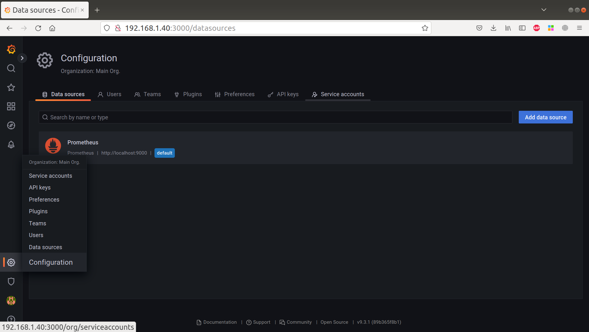

# Grafana

- [Задание](#Задание)
- [Установка](#Установка)
- [Вывод графика значений метрики в Kibana](Вывод_графика_значений_метрики_в_Kibana)

## Задание
1. Установить Grafana
2. Настроить следующие параметры:
   - По умолчанию должна быть выбрана тёмная тема
   - Временная зона по умолчанию должна быть Europe/Moscow
   - Максимальное число хранимых версий каждого дашборда - 30
3. Используя любой отличный от Grafana инструмент, вывести график значений метрики prometheus_tsdb_head_series за последний час.

## Установка
Скачиваем deb-пакет и устанавливаем его
```
sudo apt-get install -y adduser libfontconfig1
wget https://dl.grafana.com/oss/release/grafana_9.3.1_amd64.deb
sudo dpkg -i grafana_9.3.1_amd64.deb
```
Запускаем Grafana как службы systemd
```
sudo systemctl daemon-reload 
sudo systemctl start grafana-server 
sudo systemctl status grafana-server 
sudo systemctl enable grafana-server.service 
```

Настроим параметры в /etc/grafana/grafana.ini
```
[users]
default_theme = dark

[date_formats]
default_timezone = Europe/Moscow

[dashboards]
versions_to_keep = 30
```

Перезапустим Grafana
```
sudo systemctl restart grafana-server
```


## Вывод графика значений метрики в Kibana

Установим Metricbeat
```
wget https://mirror.yandex.ru/mirrors/elastic/8/pool/main/m/metricbeat/metricbeat-8.1.1-amd64.deb
sudo dpkg -i metricbeat-8.1.1-amd64.deb 
```

Настроим конфигурацию /etc/metricbeat/metricbeat.yml
```

```

Включим модуль для Prometheus
```
sudo metricbeat modules enable prometheus
```