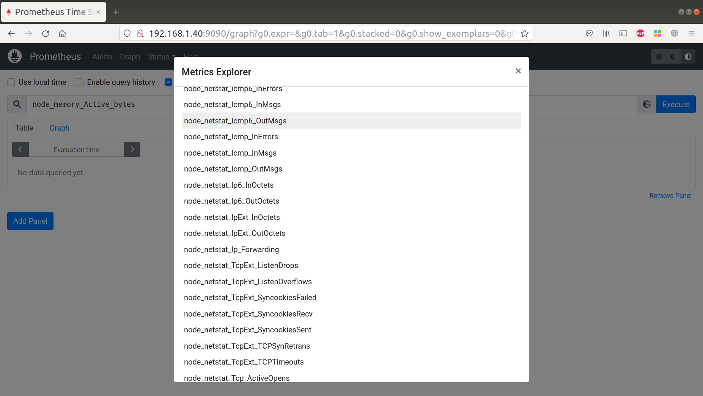

# Node Exporter

- [Задание](#Задание)
- [Установка](#Установка)
- [Отключение неиспользуемых коллекторов](#Отключение-неиспользуемых-коллекторов)

## Задание
1. Установить Node Exporter и добавить его в Prometheus
2. Поскольку не все коллекторы используются в вашей системе, необходимо отключить те, которые не используются.
3. Сделать простой скрипт для Textfile-collector по любой метрике, которая отсутствует в node-exporter, обосновать почему вы решили ее использовать.

## Установка
Скачиваем архив со всеми необходимыми файлами
```
wget "https://github.com/prometheus/node_exporter/releases/download/v1.3.1/node_exporter-1.3.1.linux-amd64.tar.gz"
```
Распакуем архив в директорию /tmp
```
tar xvf node_exporter-1.3.1.linux-amd64.tar.gz -C /tmp
```
Скопируем node_exporter в необходимую директорию
```
cp /tmp/node_exporter-1.3.1.linux-amd64/node_exporter /usr/local/bin/ 
```
Сделаем его исполняемым
```
chmod +x /usr/local/bin/node_exporter
```
Создадим директорию для textfile коллектора
```
mkdir -p /opt/prometheus_exporters/textfile
```
Сменим владельца
```
chown prometheus:prometheus -R /opt/prometheus_exporters/textfile
```
Создадим юнит для systemd
```
cat << EOF > /lib/systemd/system/node_exporter.service

[Unit] 
Description=Node-Exporter service 

[Service] 
User=prometheus 
Group=prometheus 

ExecStart=/usr/local/bin/node_exporter --web.listen-address=0.0.0.0:9100 --collector.textfile.directory=/opt/prometheus_exporters/textfile \
--collector.disable-defaults \
--collector.cpu \
--collector.diskstats \
--collector.filesystem \
--collector.loadavg \
--collector.meminfo \
--collector.netstat \
--collector.sockstat \
--collector.time 

[Install] 
WantedBy=multi-user.target

EOF
```
Запустим экспортер
```
systemctl daemon-reload 
systemctl enable node_exporter.service
systemctl start node_exporter.service
```
Добавим конфигурацию в Prometheus
```
cat << EOF >> /etc/prometheus/prometheus.yml
  - job_name: node
    static_configs:
      - targets: ['localhost:9100']
EOF 
```
Применим изменения Prometheus
```
systemctl restart prometheus.service
```


## Отключение неиспользуемых коллекторов

Для этого в `/lib/systemd/system/node_exporter.service` добавим
```
--collector.disable-defaults \
--collector.cpu \
--collector.diskstats \
--collector.filesystem \
--collector.loadavg \
--collector.meminfo \
--collector.netstat \
--collector.sockstat \
--collector.time 
```