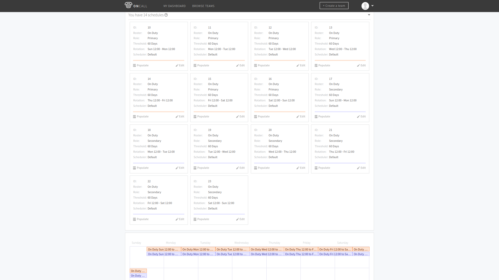

# Oncall

## Задание

Задание
1. Установить Oncall
2. Создать тестовых пользователей, больше 3
3. Завести команды 2-3 команды, больше 1
4. Заполнить расписание дежурств на 2 месяца вперед, есть 2 варианта заполнения
   - Через веб-интерфейс
   - Через API
5. В 1 день должно быть 2 дежурных (Primary, Secondary). Secondary текущего дня,стает Primary на следующий день


## Заполнение расписания
Пересменка каждые 5 дней в 12 часов дня

````./run```` - единая точка входа для всех команд
````./run -h```` - для описания всех возможных опций

### Через веб-интерфейс
Создадим шедулеры на каждый день


Заполним график дежурств вручную


### Через API
