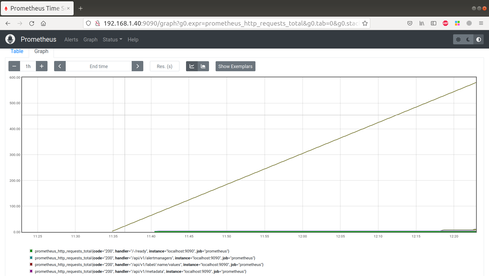
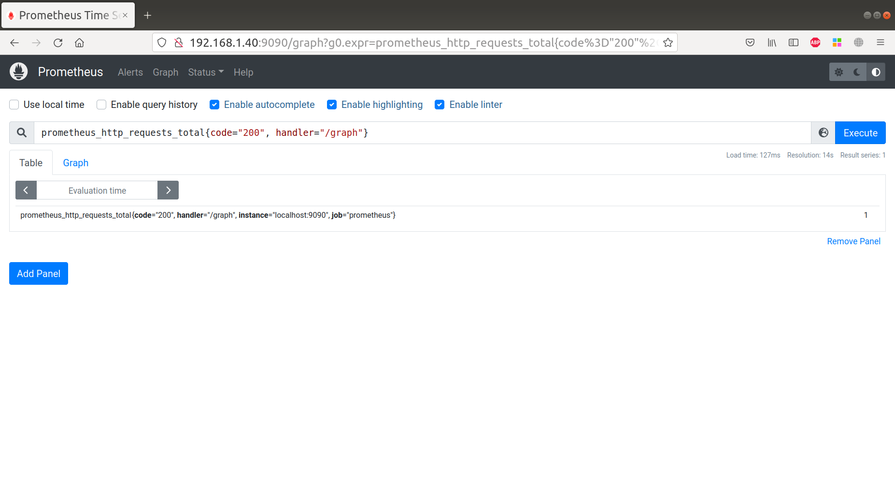
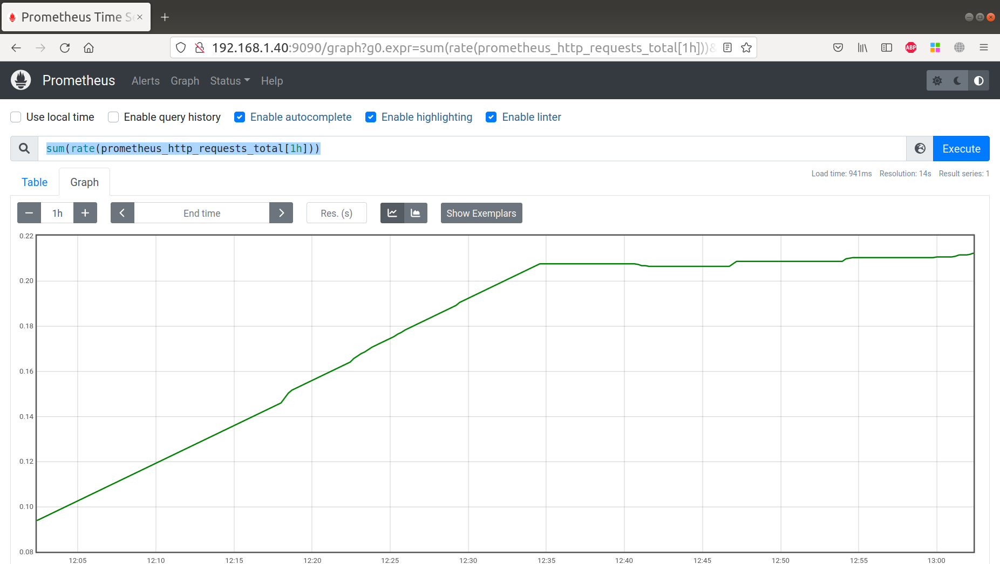
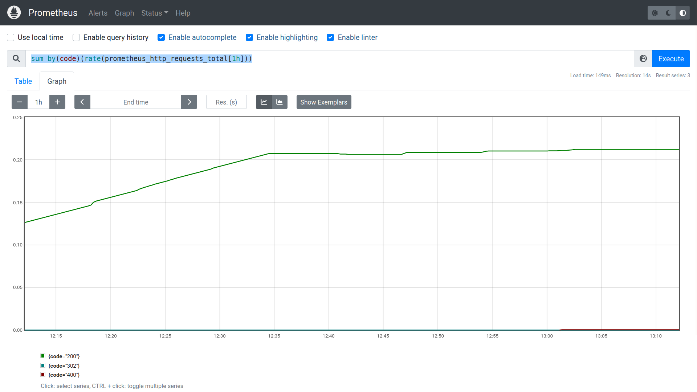

# Prometheus

- [Задание](#Задание)
- [Установка](#Установка)
- [Использование PromQL](#Использование-PromQL)
- [Recording rule для сложного запроса](#Recording-rule-для-сложного-запроса)

## Задание

Задание

1. Установить и настроить Prometheus, замониторить пром.
2. Показать использование PromQL
3. Записать recording rule для какого-либо сложного вычисления.

## Установка 
Скачиваем архив со всеми необходимыми файлами
```
wget "https://github.com/prometheus/prometheus/releases/download/v2.37.0/prometheus-2.37.0.linux-amd64.tar.gz"
```
Распакуем архив в директорию /tmp
```
tar xvf prometheus-2.37.0.linux-amd64.tar.gz -C /tmp
```
Скопируем бинарные файлы Prometheus и утилиты проверок promtool
```
cp /tmp/prometheus-2.37.0.linux-amd64/prometheus /usr/local/bin/
cp /tmp/prometheus-2.37.0.linux-amd64/promtool /usr/local/bin/ 
```
Создадим директорию для конфигурационных файлов и TSDB Prometheus
```
mkdir -p /etc/prometheus 
mkdir /var/lib/prometheus
```
Скопируем файлы консоли
```
cp -r /tmp/prometheus-2.37.0.linux-amd64/consoles /etc/prometheus cp -r /tmp/prometheus-2.37.0.linux-amd64/console_libraries /etc/prometheus
```
Создадим простой файл конфигурации 
```
cat << EOF > /etc/prometheus/prometheus.yml 
global:   
  scrape_interval: 15s 
scrape_configs:   
  - job_name: 'prometheus'     
    scrape_interval: 5s     
    static_configs:       
      - targets: ['localhost:9090'] 
EOF
```
Создадим специального пользователя и группу
```
useradd --no-create-home --shell /bin/false prometheus
```
Сменим разрешения на директории
```
chown prometheus:prometheus -R /etc/prometheus
chown prometheus:prometheus -R /var/lib/prometheus/
```
Создадим юнит для запуска
```
cat << EOF > /lib/systemd/system/prometheus.service 

[Unit] 
Description=Prometheus service 

[Service] 
User=prometheus 
Group=prometheus 

ExecStart=/usr/local/bin/prometheus --config.file /etc/prometheus/prometheus.yml --storage.tsdb.path /var/lib/prometheus/ --web.console.templates=/etc/prometheus/consoles --web.console.libraries=/etc/prometheus/console_libraries 

[Install] 
WantedBy=multi-user.target 

EOF
```
Запустим сервис 
```
systemctl daemon-reload 
systemctl enable prometheus.service 
systemctl start prometheus.service
```
Мониторим Prometheus


## Использование PromQL

Количество http-запросов, которые получил Prometheus
```
prometheus_http_requests_total
```



Количество http-запросов, которые получил Prometheus, по пути "/graph", на которые он ответил с кодом 200
```
prometheus_http_requests_total{code="200", handler="/graph"} 
```



Cреднее количество http-запросов, которые получил Prometheus за 1 час
```
sum(rate(prometheus_http_requests_total[1h]))
```


[Хорошее объяснение про rate](https://techannotation.wordpress.com/2021/07/19/irate-vs-rate-whatre-they-telling-you/)


Cреднее количество http-запросов по http-кодам, которые получил Prometheus за 1 час
```
sum by(code)(rate(prometheus_http_requests_total[1h]))
```


## Recording rule для сложного запроса